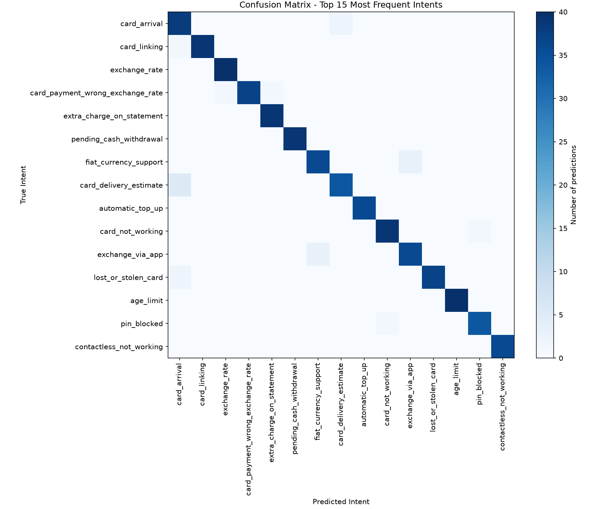

# 🏦 Banking Intent Classifier
### A production-style NLP model built with PyTorch and DistilBERT


---

## 📌 Overview

This project is a **text intent classification system** that identifies the intent behind customer banking queries — for example, detecting whether a customer wants to check their balance, transfer money, or report a lost card.

Built with **PyTorch** and a fine-tuned **DistilBERT** transformer model trained on the [Banking77 dataset](https://github.com/PolyAI-LDN/task-specific-datasets), it classifies text into **77 banking intent categories** with high accuracy.

This project directly mirrors the kind of **production NLU (Natural Language Understanding)** work used in enterprise AI voice assistants — including intent detection pipelines for major financial and retail clients.

---

## 🎯 Why This Project

During 5+ years building NLU models for enterprise clients at Interactions LLC / SoundHound AI, I worked on:

- Designing and deploying 30+ production NLU models in Python
- Achieving 60% automation rates on opening dialog states from day one
- Analyzing 50K+ utterance examples to ensure model accuracy and compliance

This project was built to demonstrate those same skills in an open, reproducible format using modern deep learning tooling.

---

## 🚀 Demo

```
Input:  "I lost my card"
Output: → lost_or_stolen_card

Input:  "what is my account balance?"
Output: → balance_not_updated_after_bank_transfer

Input:  "I want to transfer money to my friend"
Output: → transfer_into_account
```

---

## 🛠️ Tech Stack

| Tool | Purpose |
|------|---------|
| Python 3.12 | Core language |
| PyTorch 2.12 | Model training & inference |
| HuggingFace Transformers | DistilBERT pretrained model |
| scikit-learn | Label encoding & evaluation |
| pandas | Data loading & preprocessing |

---

## 📁 Project Structure

```
intent-classifier/
├── data/                   # Dataset storage
├── notebooks/
│   └── 01_explore.ipynb    # Data exploration notebook
├── src/
│   ├── model.py            # DistilBERT classifier architecture
│   ├── train.py            # Training & evaluation loops
│   ├── predict.py          # Inference / prediction logic
│   └── main.py             # End-to-end pipeline runner
├── requirements.txt        # Dependencies
└── README.md
```

---

## ⚙️ How It Works

### 1. Data
The [Banking77 dataset](https://github.com/PolyAI-LDN/task-specific-datasets) contains **10,003 training** and **3,080 test** examples across 77 real-world banking intent categories.

### 2. Model Architecture
```
Input Text
    ↓
DistilBERT Tokenizer        # Converts text → token IDs
    ↓
DistilBERT Encoder          # 66M parameters, pretrained on Wikipedia
    ↓
[CLS] Token Output          # Sentence-level representation
    ↓
Dropout (0.3)               # Regularization to prevent overfitting
    ↓
Linear Classifier           # Maps 768 → 77 intent classes
    ↓
Predicted Intent
```

### 3. Training
- **Optimizer:** AdamW (lr=2e-5)
- **Loss:** CrossEntropyLoss
- **Epochs:** 3
- **Batch size:** 32

---

## 🏃 Getting Started

**1. Clone the repo**
```bash
git clone https://github.com/YOUR_USERNAME/intent-classifier.git
cd intent-classifier
```

**2. Install dependencies**
```bash
python -m pip install -r requirements.txt
```

**3. Train the model**
```bash
cd src
python main.py
```
> **Note:** The trained model file (`model.pth`) is not included due to
> GitHub's file size limits. Running `python main.py` will train it from
> scratch — approximately 40 minutes on CPU.

**4. Run a prediction**
```bash
python predict.py
```

---

## 📦 Requirements

```
torch>=2.12
transformers>=4.40
scikit-learn>=1.4
pandas>=2.0
```

Save these to `requirements.txt` by running:
```bash
python -m pip freeze > requirements.txt
```

---

## 📈 Results

| Metric | Score |
|--------|-------|
| Training Accuracy | 91.9% |
| Test Accuracy | 90.7% |
| Test Loss | 0.396 |
| Intent Categories | 77 |
| Training Examples | 10,003 |
| Test Examples | 3,080 |

The small gap between training (91.9%) and test (90.7%) accuracy indicates the model generalized well rather than overfitting to the training data.

---

## 🔍 Error Analysis

To understand *how* the model fails — not just how often — I generated a confusion matrix and examined the most common misclassifications on the test set.



**Top confused intent pairs:**

| True Intent | Predicted Intent | Times Confused |
|---|---|---|
| `why_verify_identity` | `verify_my_identity` | 11 |
| `wrong_exchange_rate_for_cash_withdrawal` | `cash_withdrawal_charge` | 6 |
| `balance_not_updated_after_bank_transfer` | `transfer_timing` | 5 |
| `card_delivery_estimate` | `card_arrival` | 5 |
| `get_disposable_virtual_card` | `getting_virtual_card` | 5 |
| `beneficiary_not_allowed` | `failed_transfer` | 4 |
| `card_about_to_expire` | `order_physical_card` | 4 |
| `card_payment_not_recognised` | `compromised_card` | 4 |
| `declined_transfer` | `declined_card_payment` | 4 |
| `pending_transfer` | `transfer_timing` | 4 |

**Key takeaway:** the model's errors are not random — nearly every confused pair is between two intents that are genuinely close in meaning (e.g. `why_verify_identity` asks *why* verification is needed, while `verify_my_identity` is the action of verifying). This indicates the model has learned a coherent semantic representation of the intent space rather than overfitting to surface-level keywords. In a production system, pairs like these would be strong candidates for either merging into a single intent or adding clarifying follow-up prompts.

---

## 🔮 Future Improvements

- [ ] Add a simple web UI using Flask or FastAPI
- [ ] Fine-tune on custom domain-specific utterances
- [ ] Add confidence scores to predictions
- [ ] Export model to ONNX for faster inference
- [ ] Add support for Spanish language intents

---

## 👩‍💻 Author

## 👩‍💻 Author

**Monica Pittman**
Full-Stack Software Engineer | NLU/NLP Specialist

[](https://linkedin.com/in/monica-pittman-55914b183/)
[](https://github.com/mpittman-128)
---

## 📄 License

MIT License — feel free to use this project as a reference or starting point.